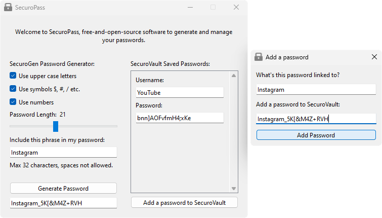

# SecuroPass

No more writing passwords on paper or forgetting your passwords... SecuroPass allows one to generate a password that is secure based on their preference such as length of password and store the passwords securely in the vault to be retrieved for later use.




## Features

- **Customise password:** choose if you want upper case letters, symbols, numbers in the password you generate.
- **Choose length:** choose the length of password you generate, up to a maximum of 48 characters.
- **Custom phrase:** choose to include a custom phrase in your password.
- **Store passwords:** store passwords securely in the SecuroVault for later use.

## Usage

This app is quite straightforward and simple, but here is the breakdown on how to use it.

**Firstly**, open the SecuroPass application.  

**Next**, on the left you will see the SecuroGen Password Generator, here, choose your preferences. If you want your password to contain uppercase letters, numbers, symbols, check the respective checkbox, choose an appropriate length of the password, recommended to be at least 12, if needed include a phrase in your password, which will be included at the start of the generated password. For example:

- ✅ Use upper case letters
- ✅ Use symbols $, #, / etc.
- ✅ Use numbers
- Password Length: 18
- Include this phrase in my password: MyPassword

Generated Password: MyPassword_K/vXc2Z

**Next**, after entering and choosing your preferences, press Generate Password button in the bottom left, below it a password will appear.

**Next**, copy this password by double clicking on it with your mouse, then right click and press 'Copy'.

**Next**, press Add Password button at the bottom right of the application.

**Next**, in the window that opens, add the username, website, service you are saving the password for, and then right click on the 'Enter a password here...' below and press 'Add Password'.

**Done!** Your password is saved for later use!
## How it functions

- **Secrets** module is used to generate cryptographically secure random passwords
- **Cryptography.fernet** module is used to encrypt the passwords with an asymmetric
 encryption method
- **Keyring** module is used to securely store the encryption key in your operating systems respective keyring manager, such as Credential Manager on Windows
- **Pyside** is used to construct the graphical user interface


## Libraries

The following libraries are required to run this code:

```
- pyside6
- cryptography
- json
- os
- sys
- string
- secrets
- keyring
```


## Contributing and feedback

Contributions are always welcome! I would love for others to contribute to this project, and it's improvement, currently it is in its early stages and may have issues performing as needed.

Feedback is also extremely valuable. I am open to any feedback you have.

- To contribute or provide feedback, contact me at [will provide a method soon]


## License and liability
The author of this software is not responsible for any damage, loss of data, or any other issues that may arise from the use of this software, including but not limited to the loss or theft of passwords. Use this software at your own risk.

The MIT License lets you do almost anything you want with this project, even making and distributing closed source versions.

[](https://choosealicense.com/licenses/mit/)